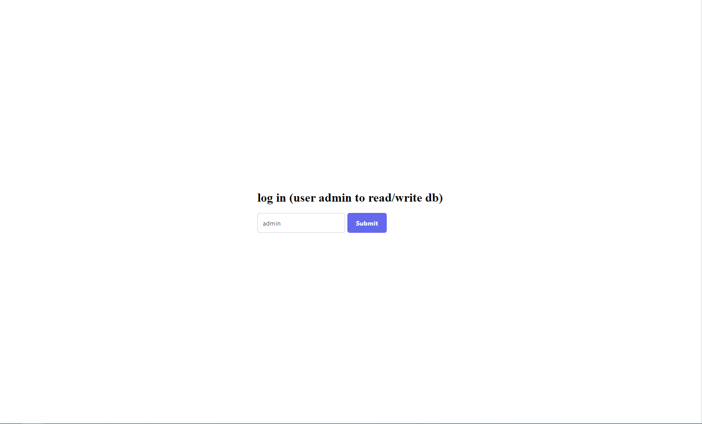
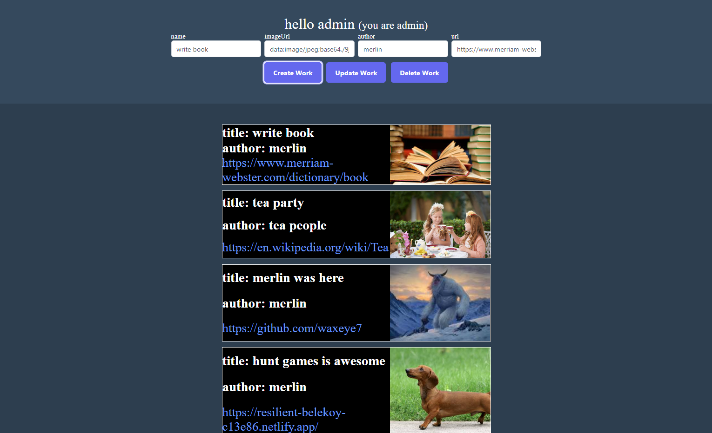
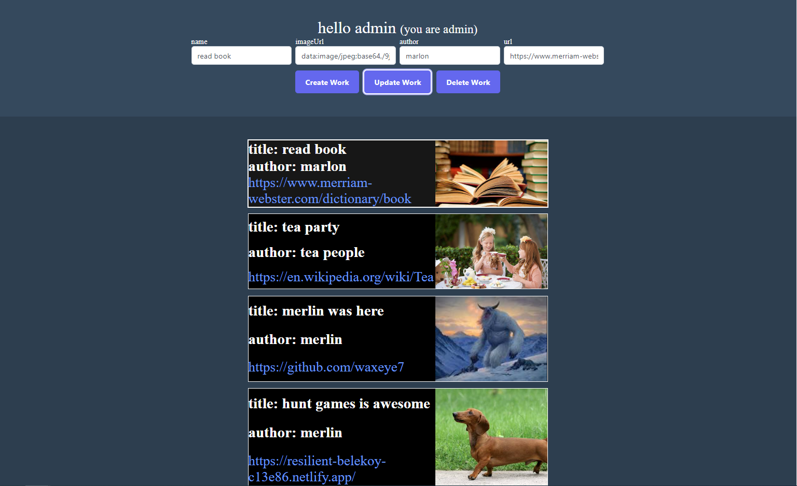
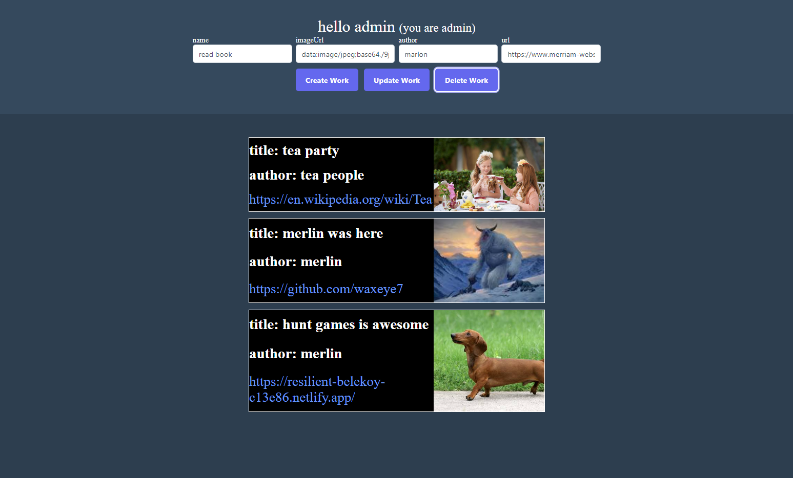

# formative-database-project
 
the idea of this project is to create a ui where the user can create/delete/update/view-all projects

note: to create/update/delete Projects, you must be logged in as 'admin'
  

<h1>login page</h1>
to verify you are an admin - just for fun not using password just wanted to check in DB if this user is admin or not
admin = admin, user != admin, merlin = admin 😉

<h1>Create</h1>

<h1>Update</h1>

<h1>Delete</h1>
